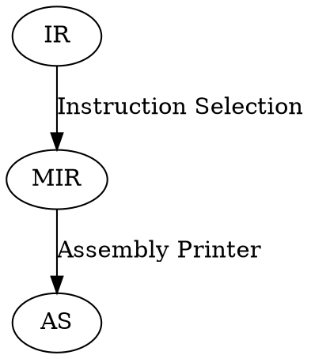
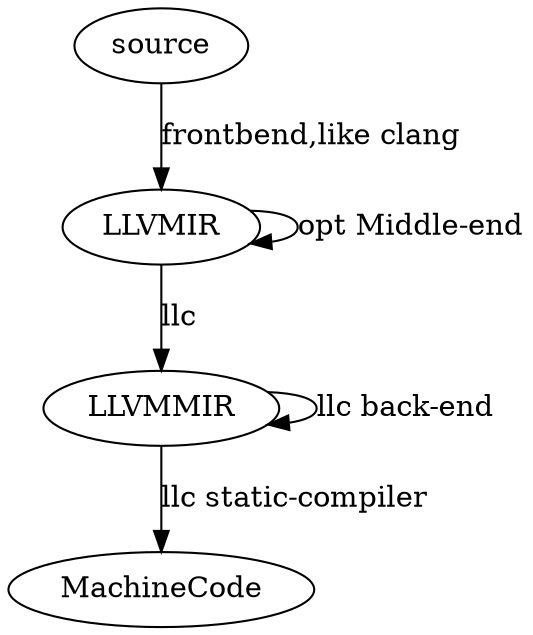

- [概念](#概念)
  - [LLVM is modular design](#llvm-is-modular-design)
  - [LLVM IR(中间表示)](#llvm-ir中间表示)
  - [LLVM MIR](#llvm-mir)
  - [Comiler](#comiler)
  - [tblgen](#tblgen)
- [例子](#例子)
- [Frontend](#frontend)
- [优化](#优化)
  - [实验](#实验)
  - [简单实现](#简单实现)
- [独立于目标代码生成器](#独立于目标代码生成器)
- [优化机器代码](#优化机器代码)
- [LLVM Backend](#llvm-backend)

# 概念
## LLVM is modular design
* 优化器的设计是基于库的
* 您可以运行您选择的优化(opt passes)
* 优化只有少部分特定于系统

## LLVM IR(中间表示)
LLVM Intermediate Representation us a **generic assembly language**
* three faces
  - Textual(.ll)
    + Human Readable
    + Pass Development&Debugging
  - Bitcode(.bc)
    + Backwards compatibility
    + Efficient format for storage
  - In-Memory
    object link
* IR是一个强类型语言
* IR是SSA(静态单一赋值的)
* 是低级的操作
* 有能力代表所有高级语言,整个编译期都可以代表

> [IR文件的布局](https://zhuanlan.zhihu.com/p/66793637#:~:text=%E7%9A%84build%E8%BF%87%E7%A8%8B-,4.%20IR%E6%96%87%E4%BB%B6%E7%9A%84%E5%B8%83%E5%B1%80,-4.1%20Target%20information)

## LLVM MIR

$
X86 MIR \neq AArch64 MIR \neq ARM MIR
$
> * 目标特定机器的指令
> 从LLVM IR中创建SelectionDAG
> 合法化SDAG节点
> DAG组合优化
> 从目标指令中选择指令
> 调度和发出机器指令
> 寄存器分配- SSA销毁，寄存器分配，寄存器
> emitting代码

## Comiler


## tblgen
TableGen领域特定语言,描述寄存器、指令集等.
全集将target描述文件(.td)转换为(.inc)(#include syntax)
* 以枚举形式表示的寄存器
* 可以在.cpp文件中使用。
* 这些.inc文件将在我们构建LLVM项目时生成

# 例子
* 如何得到IR?
```
$ clang -S -emit-llvm factorial.c # factorial.ll
$ clang -c -emit-llvm factorial.c # factorial.bc
```
* IR互转
```
$ llvm-as factorial.ll # factorial.bc
$ llvm-dis factorial.bc # factorial.ll
```
* bitcode合并
```
$ llvm-link factorial.bc main.bc -o linked.bc # lined.bc
```
* 优化IR
```
$opt –passname input.ll –o output.ll
$ opt –O0 –S example.ll #least optimization level
```
> 知道的有20种,你也可以自己定义
* 执行IR
lli output.bc
* gcc 使用llvm
`
$ gcc testprog.c -S -O1 -o - -fplugin=./dragonegg.so
`

# Frontend
1. 定义一种 语言
2. 实现一个词法分析程序(lexer)
3. 定义抽象语法树AST
4. 实现一个解析器
5. 简单的解析表达式
6. 解析二进制表达式
7. 调用驱动程序进行解析
8. 在 语言 上运行 lexer和解析器
9. 为表达式生成IR代码
10. 生成IR代码的功能添加IR优化支持

> Adding JIT Support
> 构造if/then/else
> 生成循环代码
> 一元操作符

# 优化
## 实验
* 不同级别的优化
* 编写自己的LLVM pass
* 使用opt工具运行自己的pass
* 在一个新的pass中使用另一个pass
* 在pass管理器中注册一个pass
* 编写一个分析器pass
* 编写一个别名分析器pass
* 使用其他分析pass

## 简单实现
* 死代码消除
* 内联转换
* 内存优化
* 通过LLVM IR
* 转换和优化环路，
* 重新关联表达式，
* 向量化IR
* 其它

# 独立于目标代码生成器

* LLVM IR指令的生命周期
* 使用GraphViz可视化LLVM IR CFG
* 使用TableGen描述target
* 定义指令集
* 添加一个机器代码描述符
* 实现MachineInstrBuilder类
* 实现MachineBasicBlock类
* 实现MachineFunction类
* 编写一个指令选择器
* 合法化SelectionDAG
* 优化SelectionDAG
* 从DAG中选择指令
* SelectionDAG中的调度指令
> * emission
> 1. JIT 直接将代码发送到内存中
> 2. 使用MC框架为所有后端目标 生成 程序集和对象文件


# 优化机器代码

从机器代码中消除公共子表达式
分析存活时间间隔
配置寄存器
插入prologue-epilogue(序言-尾声)代码
Code emission 代码发射
尾部调用优化
同胞(兄弟Sibling)调用优化

# LLVM Backend

* 定义寄存器和寄存器集
* 定义调用约定
* 定义指令集
* 实现帧降低
> 函数调用的序言和尾声
* 打印指令
* 选择一个指令
* 添加指令编码
* 支持一个子目标
* 降低到多个指令
> (如mov32->mov16&mov16)
* 注册一个目标